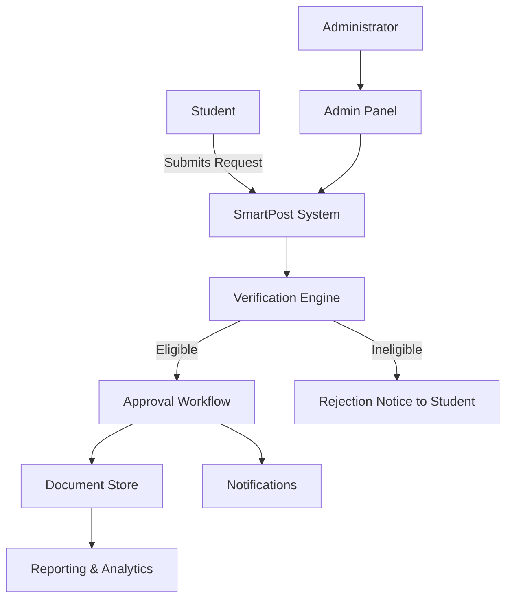
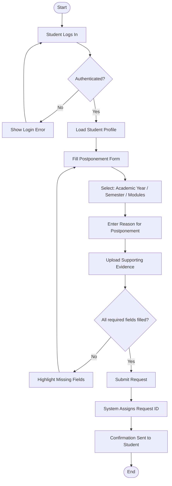
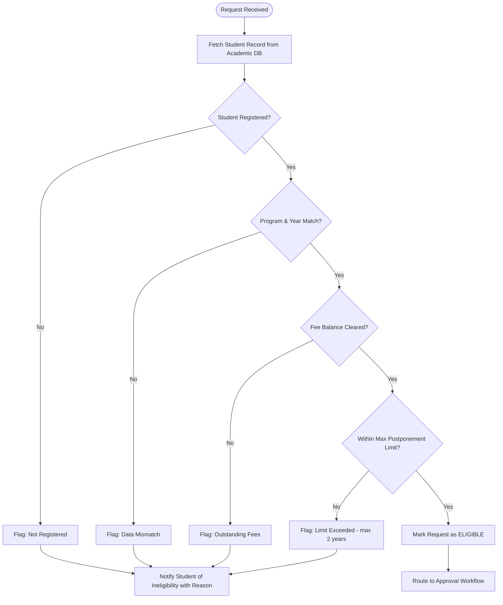
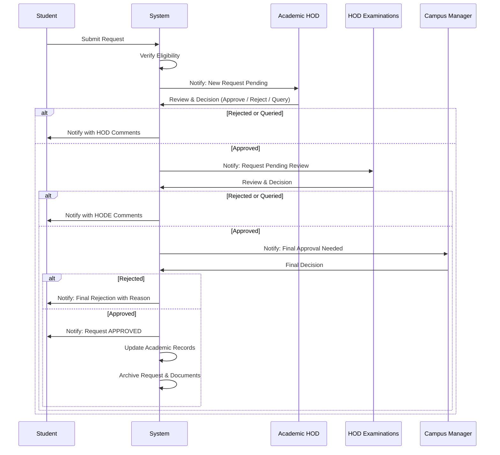
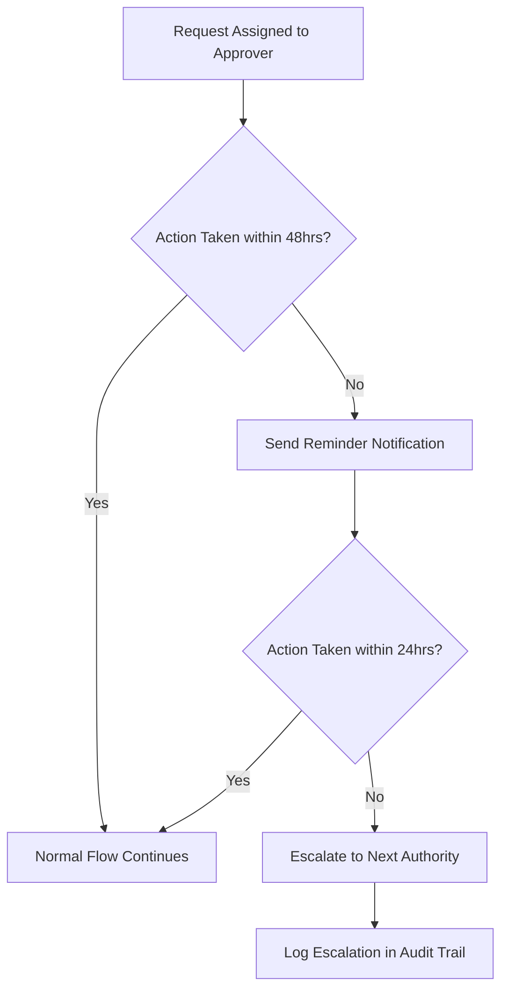
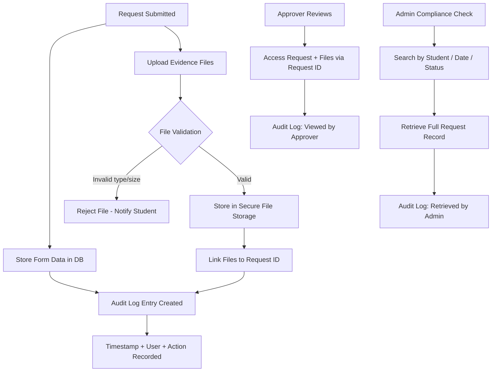
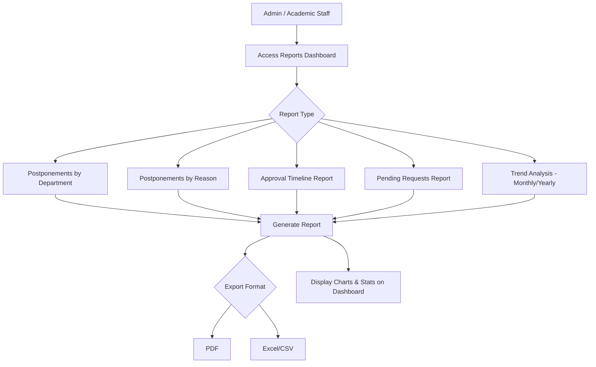
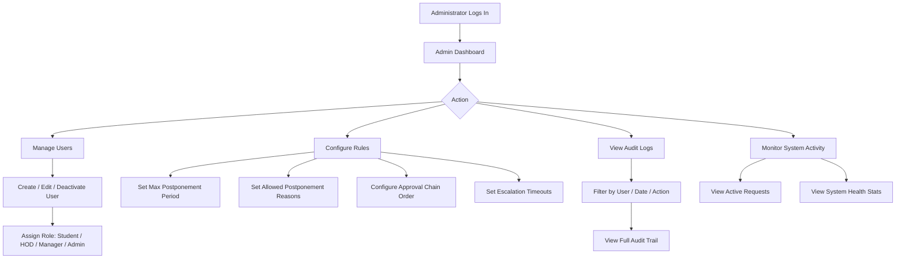
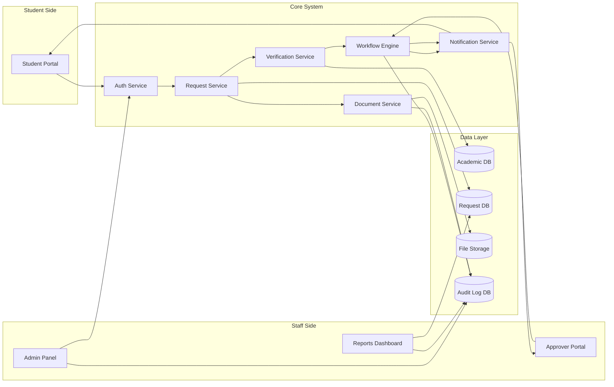
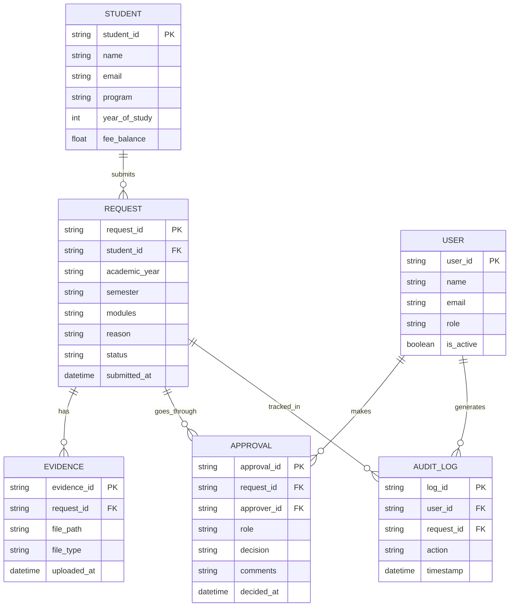

# SmartPost — System Design Document
**IAA College Digital Academic Postponement Management System**

---

## 1. System Overview

SmartPost is a web-based system that digitizes the academic postponement request lifecycle — from student submission through multi-level approval to archiving and reporting.

---

## 2. User Roles

| Role | Permissions |
|---|---|
| Student | Submit requests, upload evidence, track status |
| Academic HOD | Review, comment, approve/reject requests |
| HOD Examinations | Second-level review and approval |
| Campus Manager | Final approval authority |
| Administrator | Configure rules, manage users, view audit logs |

---

## 3. Student Request Subsystem

Students authenticate and submit postponement requests with supporting evidence.

---

## 4. Verification Subsystem

Before routing for approval, the system automatically validates student eligibility.

---

## 5. Approval Workflow Subsystem

Requests move sequentially through three approval levels. Each level can approve, reject, or request more information.

### Escalation Logic

---

## 6. Document Management Subsystem

---

## 7. Reporting & Analytics Subsystem

---

## 8. Administration Subsystem

---

## 9. Full System Data Flow

---

## 10. Database Entity Overview

---

## 11. Key Business Rules

- A student may not postpone for more than **2 cumulative academic years**
- Fee balance must be **zero or within approved threshold** to submit
- Approval must follow the fixed sequence: **HOD → HOD Exams → Campus Manager**
- Approvers have **48 hours** to act before a reminder is sent, **72 hours** before escalation
- Supported evidence file types: **PDF, JPG, PNG** — max **5MB per file**
- All actions are **immutably logged** in the audit trail
